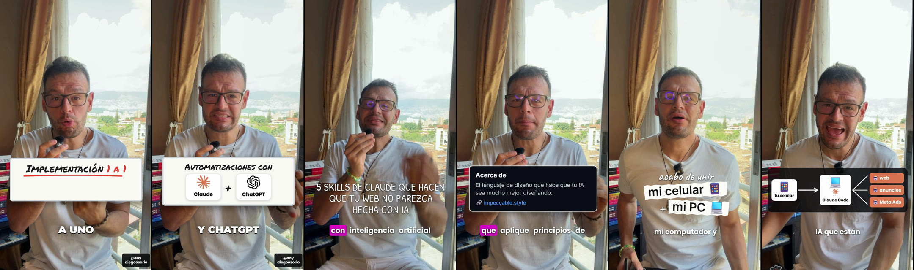

# video-imperio-edit — tu editor de reels con IA (skill de Claude Code)

Le pasas un video tuyo hablando a cámara y te lo devuelve **editado y listo para subir**: sin tus equivocaciones,
con gancho desde el segundo 0, subtítulos, tarjetas y listas que aparecen **justo cuando dices la palabra** (y nunca
te tapan la cara), pruebas reales, música que baja sola cuando hablas y tu llamado a la acción.

Hecha por [Diego Osorio](https://instagram.com/soydiegoosorio) con lo que le funcionó editando sus propios reels.

**[👉 Guía paso a paso, desde cero (Claude → Claude Code → la skill)](https://diegodoc11.github.io/video-imperio-edit/)**

  



## Instalar (copia y pega esto en Claude Code)

```
Instala esta skill de Claude Code: clónala desde https://github.com/diegodoc11/video-imperio-edit dentro de ~/.claude/skills/video-imperio-edit y corre su instalador (scripts/instalar.py). Si falta algún programa (Git, Python, Node.js, ffmpeg o whisper.cpp), instálalo conmigo paso a paso.
```

Después abre una conversación nueva para que Claude cargue la skill. ¿Aún no tienes Claude Code? Sigue la
[guía desde cero](https://diegodoc11.github.io/video-imperio-edit/).

A mano, en Windows (PowerShell):

```powershell
git clone https://github.com/diegodoc11/video-imperio-edit "$HOME\.claude\skills\video-imperio-edit"
python "$HOME\.claude\skills\video-imperio-edit\scripts\instalar.py"
```

En Mac o Linux:

```bash
git clone https://github.com/diegodoc11/video-imperio-edit ~/.claude/skills/video-imperio-edit
python3 ~/.claude/skills/video-imperio-edit/scripts/instalar.py
```

## Usarla

```
Edita este video con video-imperio-edit, estilo fucsia: C:\Videos\mi-video.mp4
```

1. **Limpia el video**: quita silencios y las frases que repetiste por equivocarte (las detecta frase por frase).
2. **Transcribe** palabra por palabra, con el segundo exacto de cada una.
3. **Arma la edición** en el estilo que elijas, con cada pieza entrando cuando la nombras.
4. **Se revisa a sí misma** (que nada tape la cara, que todo quepa) y te da una **vista previa** en el navegador.
5. Pides cambios y, cuando apruebas, **exporta** en 1080×1920 a 60 cuadros.

| Estilo | Gancho | Subtítulos | Apoyo visual |
|---|---|---|---|
| `tablero` | sticker blanco tipo Instagram | una palabra en MAYÚSCULAS | pizarra con letra de marcador que se escribe sola |
| `fucsia` | escrito a mano | la palabra que dices, resaltada | tarjetas de logo + ficha "Acerca de" |
| `stickers` | palabras a mano + papel rasgado | pequeños, 2-3 palabras | etiquetas, X rojas, chat, terminal |

Qué más puedes pedirle: "quita la marca de agua de abajo", "pon mi logo", "usa esta música", "cuando digo
*mis resultados* muestra estas capturas", "edítalo como este reel" (le pasas una referencia).

## Qué necesitas

| | Para qué | Costo |
|---|---|---|
| Claude con plan Pro o superior | Claude Code (quien edita) | tu plan |
| Git, Python 3.10+, Node.js 20+, ffmpeg, whisper.cpp | el motor (Claude te ayuda a instalarlos) | gratis |
| ~4 GB de disco | modelo de transcripción | gratis |

No pide llaves ni cuentas de terceros: transcribir, preparar y exportar corre en tu computador.
Probada en Windows 11. En Mac está preparada para funcionar, pero se ha probado menos: si algo falla, abre un *issue*.

**Música:** no viene incluida (derechos de autor). Deja una pista libre de derechos (por ejemplo de
[Pixabay Music](https://pixabay.com/music/)) en `recursos/musica/`. Los efectos de sonido sí vienen.

## Qué trae

```
SKILL.md               instrucciones para Claude (flujo, reglas, estilos, tipos de escena)
scripts/
  instalar.py          entorno + programas + modelo de transcripción
  preparar.py          cortes de silencio, transcripción por palabra, video SDR 1080x1920, seguimiento de la cara
  frases.py            detector de equivocaciones (transcribe cada frase por separado)
  kit.py               zona segura bajo la barbilla, mezcla de audio, fuentes, logos, quitar marca de agua
  hoja.py              hoja de revisión con la hora de cada cuadro
plantilla/
  build.py             la plantilla: eliges estilo y llenas GANCHO, ESCENAS y CTA
  recetas/             los build.py reales de 3 reels (tablero, fucsia, stickers) con los efectos avanzados
recursos/              fuentes, efectos de sonido, logos (y tu música)
docs/                  la guía de instalación (GitHub Pages)
```

**¿En qué se diferencia de las otras skills de Diego?**

| Skill | Tú en el video | Para qué |
|---|---|---|
| **video-imperio-edit** (esta) | Grabado, a pantalla completa | Edición de reels: cortes, subtítulos, apoyo visual, CTA |
| [reel-motion](https://github.com/diegodoc11/reel-motion) | Recortado dentro de un diseño animado | Reels que se ven producidos por un estudio |
| [anuncios-animados](https://github.com/diegodoc11/anuncios-animados) | No apareces | Anuncio animado desde un guion, con voz de IA |

## Créditos y licencias

- El código de esta skill: **MIT** (ver [LICENSE](LICENSE)).
- Render: [HyperFrames](https://github.com/heygen-com/hyperframes) (Apache-2.0) · animación: [GSAP](https://gsap.com).
- Transcripción: [whisper.cpp](https://github.com/ggml-org/whisper.cpp) (MIT). Seguimiento de la cara: [OpenCV](https://opencv.org) (Apache-2.0).
- Fuentes: Montserrat, Inter, Poppins, Permanent Marker, Patrick Hand SC, Caveat, DM Serif Display y JetBrains Mono,
  bajo SIL Open Font License 1.1 (ver `recursos/fonts/LICENCIAS.md`).
- Logos: [simple-icons](https://simpleicons.org) (CC0). Las marcas pertenecen a sus dueños.
- Efectos de sonido: sintetizados para esta skill, libres de usar.
- Esta skill no está afiliada a Anthropic ni a HeyGen.
